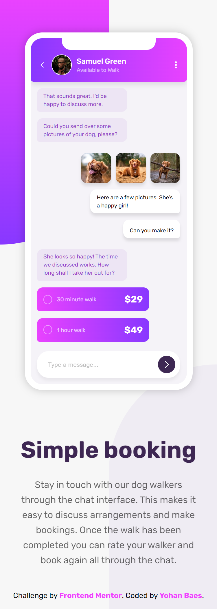
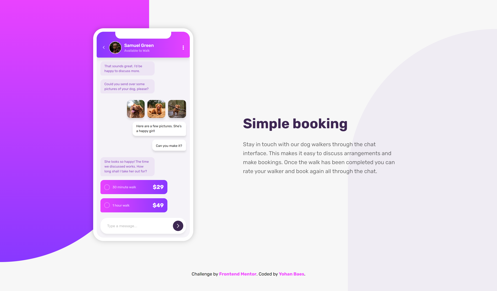

# Frontend Mentor - CSS Chat illustration

This is a solution to the [Result summary component challenge on Frontend Mentor](https://www.frontendmentor.io/challenges/chat-app-css-illustration-O5auMkFqY/hub).

## The challenge

Your challenge is to build out this page and get it looking as close to the design as possible.

## Screenshot

### Mobile Screenshot

### Desktop Screenshot

## Links

- Solution URL: --
- Live Site URL: https://raink31.github.io/020-CSS-Chat-illustration/

## Built with

- HTML5
- CSS
- Flexbox
- CSS Grid
- Mobile First Workflow

## Author

- Frontend Mentor - https://www.frontendmentor.io/profile/Raink31
